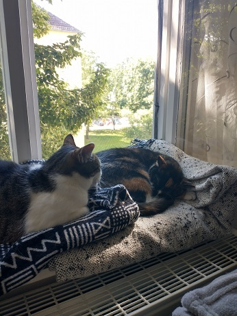

# Yearbook

## Irene
Birthday: 02 December\
City of Origin: Thesssaloniki, Greece

### Get to Know Me
  I have studied Theoritical Linguistics and Semiotics but I've been troobleshooting computers since I was a kid.
  I live in Berlin with my boyfriend and our two cats, Chilo and Bobo.

### Hobbies
   I play guitar and drums and I'm an avid gamer. Also, when I'm not reading history books I solder electronic kits.

### How is your experience so far in the DHTA?
   So far it has been really rewarding!

### What do you want to do when COVID is over?
   I would like to finally travel to Japan as my flight was cancelled because of COVID :(

\pagebreak

## Camila Belen Siede

Birthdate: 20 August 1994/
City of Origin: Buenos Aires, Argentina/
Family status: Married

### Get to know me

I am a Political Scientist  by training but I am becoming a web developer by passion!

My hobbie is watching movies. I have the most lovely cat in the world. She is in Buenos Aires right now so, I miss her so much.
I could say that my favorites movies are the Harry Potter saga.
Thinking about music I love Taylor Swift.

Favorite food?  Empanadas (Argentinian ones, of course)

### How is your experience so far in the DHTA?
So far so great! We are learning a lot.

### What do I want to do when COVID is over?
Visit Argentina without having to quarantine! 

\pagebreak

## Sebastian Banz

Birthdate: 01. March 1992/
City of Origin: Heidenheim an der Brenz, Germany/
Family status: Married/

### Get to know me
My wife and I have two cats who we love dearly, Chromie and Maiev. My favourite hobby is playing video games, but I also enjoy reading books (crime and fantasy). As far as sports go I watch Esports and go running on occassion.

### How is your experience so far in the DHTA?
I am having a great time and alread learned a lot about git, which so far I have only used occassionally and in a very limited fashion. I am very much looking forward to the future classes and am excited about what's coming.

### What do I want to do when COVID is over?
I want to go on a nice vacation somewhere warm to the sea. And I very much want to go back to my hometown and meet a lot of my friends who I mostly have not seen for over a year.

